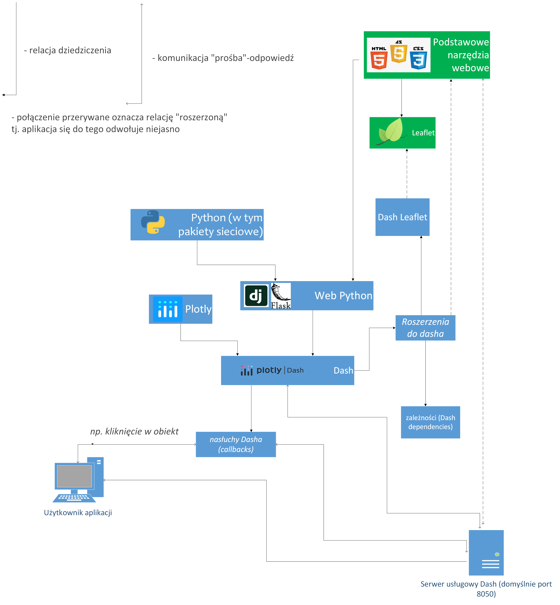

# PGW_projekt_2025 - Interaktywna mapa historyczna gminy Jarocin

## UWAGA! PROJEKT NIE JEST DALEJ ROZWIJANY TJ. OD DNIA 16 KWIETNIA 2025.

## Spis
* [Autorzy](#autorzy)
* [Informacje o mapie, cel i idea stworzenia mapy](#informacje-o-mapie)
* [Dane (skąd pobrane dane, w jaki sposób przetworzone)](#dane)
* [Opis możliwości mapy oraz interfejsu użytkownika (np screen z opisem)](#opis-możliwości-mapy)
* [Struktura systemu w postaci graficznej wraz z opisem (warstwy, biblioteki, klasy wraz z powiązaniami)](#struktura-systemu)
* [Najważniejsze, najciekawsze najbardziej spektakularne fragmenty kodu wraz z opisem](#kod)

## Autorzy
- Aleksander Żywień
- Marcel Tomczak

## Informacje o mapie
Jest to interaktywna mapa przedstawiająca: 
- topografię terenu
- lokalizacje zabytków
- historyczny układ zabudowy i dróg
dla gminy Jarocin z podkładem historyczym.

## Dane
- Dane o drogach i budynkach zostały pobrane z BDOT10k z geoportal.gov.pl
- Granica miasta została pobrana z groportal.gov.pl
- Środki budynków utworzono na bazie centroidów z warstwy budynków
- Historyczne mapy topograficzne:
    - Messtischblatt, niemieckie opracowania kartograficzne
    - Niestandardowe opracowania topograficzne (lata 80.)
- Jako referencja - współczesny podkład OpenStreetMap
  
## Zastosowania
Zastosowania serwisu mogą obejmować między innymi planowanie tras turystycznych, analizę zmian w topografii, porównywnanie ilościowe stanu zabudowy oraz dróg między podanymi latami.

## Opis możliwości mapy

1. Interaktywna mapa
2. Przycisk odpowiadający za możliwość wyświetlania/chowania centroidów budynków
3. Lista z punktami oznaczającymi ciekawe miejsca, z możliwością włączenia/wyłączenia ich
4. Lista radiowa z możliwością wyboru miejsca, do którego widok zostanie przybliżony.
5. Pola wyboru z możliwość wyświetlania wybranej ilości warstw na raz
6. Suwak czasowy z możliwością zmiany podkładu mapy
7. Suwak odpowiadający za tryb nocny
8. Kontrolki odpowiadające za przyliżenie, oddalanie i pełny ekran
9. Kontrolka odpowiadająca za lokalizacje na mapie
10. Kontrolka umożliwiająca rysowanie linii, poligonów i mierzenie odległości na mapie

# Struktura systemu


Wykorzystane biblioteki:
os, dash_bootstrap_components, dash, dash_leaflet, dash_leaflet.express, dash.dependencies, dash_extensions.javascript

# Kod

```python
dd_options = [dict(value=c["name"], label=c["name"]) for c in miejsca]
dd_defaults = [o["value"] for o in dd_options]
geojson = dlx.dicts_to_geojson([{**c, **dict(tooltip=c['name'], id=c['name'])} for c in miejsca])
geojson_filter = assign("function(feature, context){return context.hideout.includes(feature.properties.name);}")
```

W tym fragmencie najpier kod tworzy listę opcji dla komponentu dropdown, dla każdej pozycji w liście miejsca tworzy słownik z wartościami value - wartość wewnętrzna oraz label - etykieta widoczna dla użytkownika. Następnie ustawia domyślnie zaznaczone wszystkie pozycje w dropdown i konwerstuje dane do formatu geojson. Na koniec tworzy funkcję filtrującą w JavaScript, gdzie context.hideout - wartości przekazane z dropdown, includes() - sprawdza czy nazwa miejsca jest na liście zaznaczonych, przez co finalnie pokazuje tylko zaznaczone miejsca.


```python
def toggle_layers(selected_layers, n_clicks):
    layer_mapping = {
        "granice": dl.GeoJSON(url="/assets/dane/granice.geojson"),
        "drogi": dl.GeoJSON(url="/assets/dane/roads.geojson"),
        "budynki": dl.GeoJSON(url="/assets/dane/budynki.geojson")
        }
    
    layers = [layer_mapping[layer] for layer in selected_layers if layer in layer_mapping]
    
    btn_color = "primary"
    btn_content = [html.I(), "Środki budynków"]
    
    if n_clicks % 2 == 1:
        layers.append(dl.GeoJSON(
            url="/assets/dane/budynki_cent.geojson",
            cluster=True,
            zoomToBoundsOnClick=True,
            superClusterOptions={"radius": 100}
        ))
        btn_color = "success"
        btn_content = [html.I(), "Ukryj budynki"]
    
    return layers, btn_color, btn_content
```

Ta funkcja jest callbackiem zarządzającym warstwami mapy, wraz zestanem przycisku. Parametrami wejściowymi są: selected_layers - lista zaznaczonych warstw z checklisty i n_clicks - liczba kliknięć przycisku. Najpier w layer_mapping tworzony jest słownik przypisujący klucze warstw do komponentów GeoJSON. Następnie kod filtruje aktywne warstwy, kod dodaje tylko te warstwy, które zostały zaznaczone przez użytkownika w selected_layers oraz istnieją w layer_mapping. Następnie określana jest domyślna zawartość i kolor przycisku. Jest to sterowane funkcją warunkową if, gdzie pierwsze kliknięcie dodaje warstwę z centroidami budynków i zmienia kolor na zielony, z kolei drugie kliknięcie usuwa warstwę, przywracając stan pierwotny. Każde kolejne kliknięcie kontynuuje przełączanie między warstwami.

```python
def ChooseYear(value):
    if value == 2024:
        overlay = dl.TileLayer(),
    else:
        # ładuje psuedo-kafelki dla wybranego roku
        png_scan = [os.path.join('assets','skany',str(value),p) for p in 
                    os.listdir(os.path.join('assets','skany',str(value)))]
        png_scan.sort() # sortuje alfabetycznie w celu lepszego zarządzania
        # lista składana tworząca obiekty dla nich
        overlay = *[dl.ImageOverlay(opacity=1, url=p, bounds=img_bounds[e])
         for e,p in enumerate(png_scan)],
    return overlay
```

Ten fragment jest uruchamiany przez zmianę roku na osi czasu. Jeżeli odnosi się do współczesnych czasów to ładuje tylko podkład OSM. W przeciwnym razie tworzy listę składaną ze ścieżkami do zdjęć (kafelków) znajdujących się w danym folderze do wybranego roku, sortuje je, a następnie na tworzy na ich bazie podkład mapy realizowany rownież w formie listy składanej

```javascript
window.dash_clientside = Object.assign({}, window.dash_clientside, {
    clientside: {
        switchTheme: function(switchOn) {
            document.documentElement.setAttribute("data-bs-theme", switchOn ? "light" : "dark");
            return window.dash_clientside.no_update;
        }
    }
});
```
Ten kod znajduje się w osobnym pliku JavaScript i jest odpowiedzialny za przełączanie między motywem jasnym, a czarnym. Najpierw dash_clientside służy do rozszerzenia tego globalnego obiektu w przeglądarce, a Object.assign() służy do łączenia istniejących i nowych właściwości. Tworzona jest funkcja switchTheme dostępną z poziomu komponentów Dash, a w środku niej modyfikuje się atrybut data-bs-theme. SwitchOn - wartość z przełącznika (true/false), jeśli switchOn jest true - ustawia motyw "light", jeśli switchOn jest false: ustawia motyw "dark".


